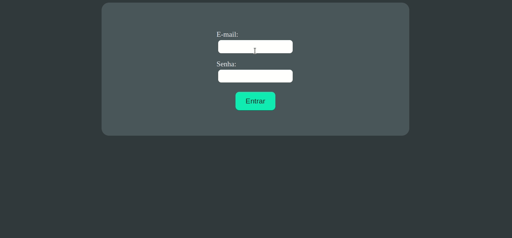

# TRYBEWALLET 🤑

Project developed in the Front-end Module at the [Trybe](https://www.betrybe.com/) course.

This project develops an expenses control with currency converter.

The user should be able to:
  * Add, remove and edit expenses.
  * View a table of expenses.
  * View the total expenses converted to BRL.

---
🎯 **Objective**: put into practice the following abilities:
* Properly use `Redux` with `React` and `Thunk`.

## 🛠️ **Used tools:**
* React
* Redux
* JSX
* Thunk
* CSS
---

### 🔗 Page Link
* [TrybeWallet](https://queite.github.io/trybewallet/#/)

---

### 🔎 Project Preview

&nbsp;

All [Trybe](https://www.betrybe.com/) projects use `linters`, `Git` and `GitHub`.
